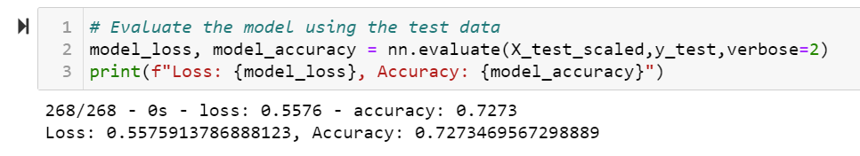
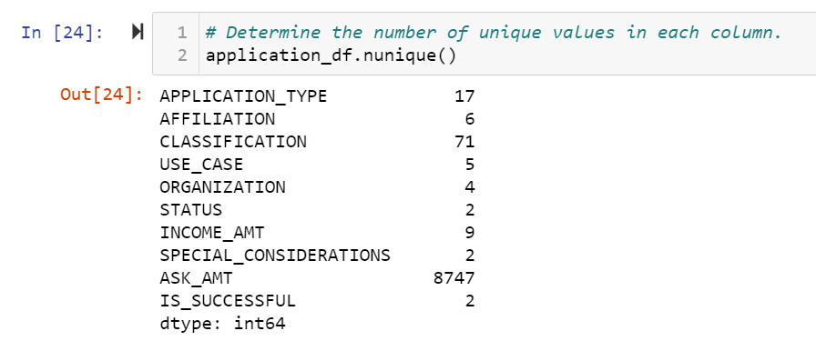
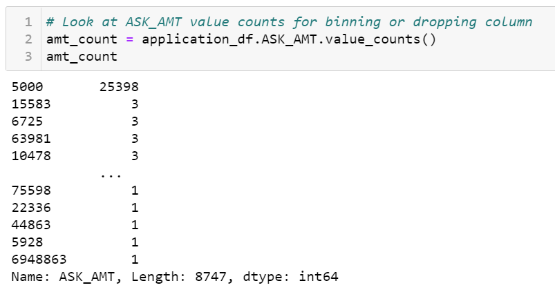
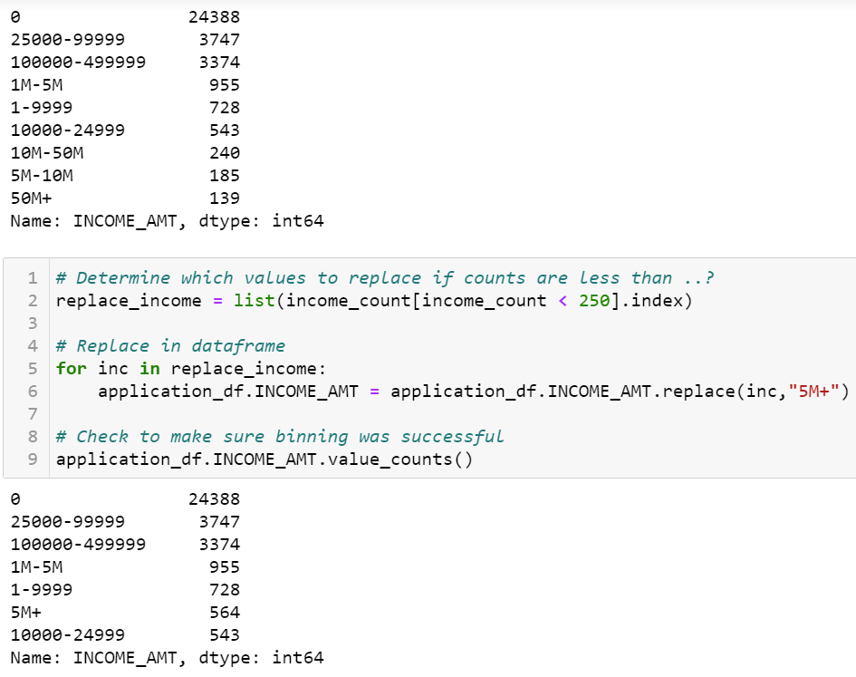
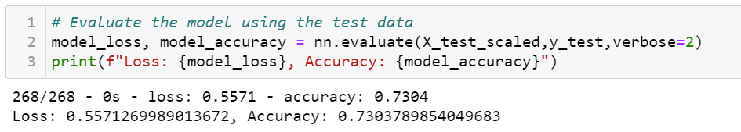

# Neural_Network_Charity_Analysis
## Project Overview
In the following project, we implemented a neural network with the tensor flow library to determine whether organizations would be successful if they received funding from a hypothetical charitable organization. We specifically created a binary classifier considering we are only interested in predicting successful or unsuccessful outcomes. We used a dataset with over 30,000 organizations where we applied the neural network workflow, which requires us to preprocess the data by encoding categorical variables, reducing the noise from variables, and dropping columns if necessary. From there, we compiled, trained, and evaluated the model. 

## Resources
- Python 3.7.6
  - Pandas
  - Scikit-learn
  - TensorFlow
- Jupyter Notebook

## Results
- Target Variable:
  - Success outcome column

- Features
  - Application type
  - Affilation
  - Government organization classification
  - Use case for funding
  - Organization type
  - Status of organization
  - Income classification
  - Special considerations for application
  - Funding amount requested

- The following columns were removed since they are only used for identification purposes
  - EIN
  - NAME

<h3 align="center"> Initial Model Results </h3>

 

The initial model contained an input layer with 80 neurons and a hidden layer with 30 neurons to help handle the vast dataset with over 30,000 rows and several columns. Eighty neurons were used in the first hidden layer since it is good practice to use roughly double the number of input features. The initial model reached an accuracy of 72.7% 

<h3 align="center"> Unique Values </h3>

 

- To increase the model's predictive accuracy, I decided to remove the ASK_AMT column due to the immense variability in the value_counts between each different value. There was a total of 8747 different unique values in the ASK_AMT column, and the vast majority of data points were asking for $5000. Binning would have been cumbersome, considering the values ranged from $5000 to over a million, so dropping the column seemed appropriate to reduce the noise.

<h3 align="center"> ASK_AMT Values </h3>

 

- I also binned the INCOME_AMT column due to the high variability of incomes from each organization. Over 24,000 organizations had an income of zero, while much fewer had incomes exceeding the millions.

<h3 align="center"> INCOME_AMT Binning </h3>

 

After re-binning and dropping the unnecessary columns, I adjusted the model by adding a hidden layer, changing the number of neurons in certain layers, and changing the activation functions. I also increased the epochs used for training the model. The optimization efforts yielded an accuracy score of 73 %. 

<h3 align="center"> Optimized Accuracy </h3>

 

